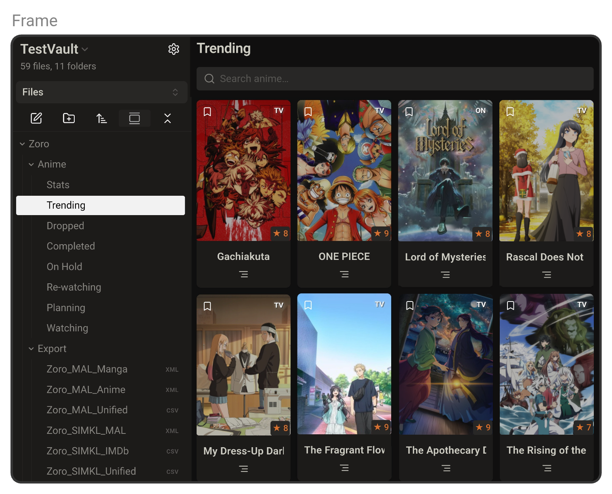

# Zoro

> "Zoro — Track anime, manga, movies and TV inside Obsidian"

---

# Quick Links

- [Trial](#-trial)
- [Recommendation ](#-Recommendation)
- [Authentication ](#-authentication)
- [Feature Overview](#-feature-overview)
- [Code Block ](#-code-block)
- [Settings](#-settings)
- [Developement](#-developement)

--- 

# Trial

### Quick summary 

- Track and show lists for **anime**, **manga**, **movies**, **TV** inside Obsidian.
    
- Connect AniList, MyAnimeList (MAL) and Simkl APIs for live data and editing.
    
- Card/table layouts, stats dashboards, connected notes and exports.

### Quick Start

- **Zoro** →Settings →  **Setup → Sample Folder** → **Create** to scaffold `Zoro/Anime/`, `Zoro/Manga/`, `Zoro/Movie/`, `Zoro/TV/` and helpful templates.

### Quick Look

- Open the **Trending** note inside `Zoro/Anime/` or `Zoro/Manga/`.  
- You’ll instantly get a preview of how media cards are displayed — no authentication needed.

---

#  Recommendation

#### **For Anime & Manga Only:**
*Recommended: AniList*
- Best overall experience for anime and manga
- Rich statistics and social features
- Modern, fast interface
- Public access available

##### **Alternative: MyAnimeList**
- If you have existing MAL account
- If you prefer the legacy platform

#### **For Multi-media (Anime + Manga + Movies + TV):**
*Recommended: SIMKL + AniList*
- SIMKL for movies and TV shows
- AniList for anime and manga
- Best coverage across all media types

# Authentication

These guides provide step-by-step instructions with video for setting up secure connections to your media tracking platforms. It takes only 2 mins if you already have a account.

- [AniList Authentication](https://github.com/zara-kasi/zoro/blob/main/Docs/anilist-auth-setup.md)

- [SIMKL Authentication](https://github.com/zara-kasi/zoro/blob/main/Docs/simkl-auth-setup.md)

- [MAL Authentication](https://github.com/zara-kasi/zoro/blob/main/Docs/mal-auth-setup.md)
  
--- 

# Feature Overview

- Connected Notes — Create note or link notes for media.
- Search — Find anime, manga, movies, or TV.
- Media Lists — Track current, completed, planned, on-hold, dropped, rewatching, or all media in one place.
- Statistics — View detailed analytics of your media.
- Trending — Discover popular anime, manga, movies, and TV.
- Editing — Update progress, status, ratings, and notes directly inside Obsidian.
- Details Panel — Long-press cover image for quick access to more details about the item. 
- Single Media— View details, ratings, and metadata for individual titles.    
- Shortcuts — Add custom external link to reviews, streaming services, social media, or news sites.  
- Export — Easily export your data from AniList, MyAnimeList, or Simkl with one click into proper formats (CSV and MAL-compatible XML for anime and manga).

# Developement

### Upcoming

- [ ] Improving the note creation and connection features by adding more Obsidian properties, such as image URLs, progress, ratings, summaries, and multiple titles.
- [ ] Shifting both the More Details panel and the Edit panel into the side panel, allowing user to view details and edit items directly without opening separate panels.

### Report Bugs
1. Check [existing issues](https://github.com/zara-kasi/zoro/issues)
2. Include console logs from Developer Tools

### Feature Requests
1. Search [existing requests](https://github.com/zara-kasi/zoro/issues)
2. Submit detailed feature description

### Acknowledgements

- **[Obsidian](https://obsidian.md/)** - The amazing note-taking app that makes this possible
- **[Obsidian Raindrop Plugin](https://github.com/mtopping/obsidian-raindrop)** - Inspiration for plugin architecture
- **[AniList](https://anilist.co/)** - Comprehensive anime and manga database with excellent API
- **[MyAnimeList](https://myanimelist.net/)** - Long-standing and widely regarded platform for cataloging, rating, and discovering anime and manga.
- **[Simkl](https://simkl.com/)** - Modern tracking platform for all media types
- **[TMDb](https://www.themoviedb.org/)** - Movie and TV database for enhanced metadata

This work would not be possible without these essential tools and services.

### License

This project is licensed under the MIT License.

---