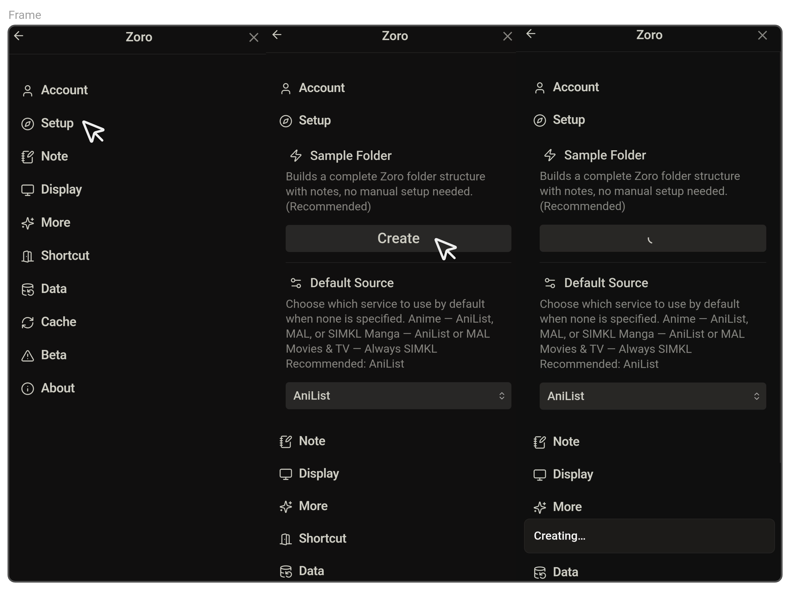
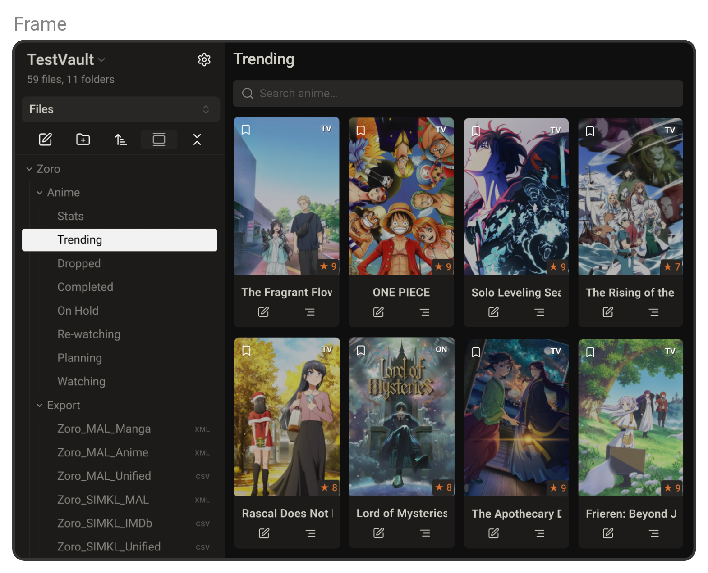

# Zoro      
      
 
  
      
> "Zoro — Track anime, manga, movies and TV with AniList, MyAnimeList and Simkl."      
      
---      

# Quick Links

- [Quick Start](#quick-start)
- [Recommendation](#recommendation)
- [Authentication](#authentication)
- [Feature Overview](#feature-overview)
- [Development](#development)

---       
      
# Quick Start      
      
## Quick summary       
      
- Track and show lists for **anime**, **manga**, **movies**, **TV** inside Obsidian.               
- Connect AniList, MyAnimeList (MAL) and Simkl APIs for live data and editing.            
- Card/table layouts, stats dashboards, connected notes and exports.      

## Quick Setup      

- **Zoro** → Settings →  **Setup → Sample Folder** → **Create** 

      

>*Creates a complete folder structure for Anime, Manga, Movies, and TV.*     
      
## Quick Look      

- Open the **Trending** note inside `Zoro/Anime/` or `Zoro/Manga/` 
      
  

>*Instant preview of media cards — no authentication needed.*

---    

# Recommendation              

| Media         | Best Option     | Alternative |
| ------------- | --------------- | ----------- |
| Anime & Manga | AniList         | MAL         |
| Movies & TV   | Simkl           | —           |
| All media     | AniList + Simkl | MAL + Simkl |
>AniList offers the fastest API and deepest integration with Zoro. MAL works too, but responses are slower — otherwise both feel very similar.

    
---

# Authentication      
      
These guides provide step-by-step instructions with video for setting up secure connections to your media tracking platforms. Setup takes about 2 minutes if you already have an account.
      
- [AniList Authentication](https://github.com/zara-kasi/zoro/blob/main/Docs/anilist-auth-setup.md)      
      
- [SIMKL Authentication](https://github.com/zara-kasi/zoro/blob/main/Docs/simkl-auth-setup.md)      
      
- [MAL Authentication](https://github.com/zara-kasi/zoro/blob/main/Docs/mal-auth-setup.md)      
        
---       

# Feature Overview      

>*All your media features — lists, stats, search, editing, and more — inside Obsidian.*

- [Connected Notes](https://github.com/zara-kasi/zoro/blob/release-v1.1.0/Docs%2Fconnected_note.md) — *Create note or link notes for media.*      
- [Search](https://github.com/zara-kasi/zoro/blob/release-v1.1.0/Docs%2Fsearch.md) — *Find anime, manga, movies, or TV.*     
- [Media Lists](https://github.com/zara-kasi/zoro/blob/release-v1.1.0/Docs%2Fmedia_list.md) — *Track current, completed, planned, on-hold, dropped, rewatching, or all media in one place.*      
- [Statistics](https://github.com/zara-kasi/zoro/blob/release-v1.1.0/Docs%2Fstatistics.md) — *View detailed analytics of your media.*      
- [Trending](https://github.com/zara-kasi/zoro/blob/release-v1.1.0/Docs%2Ftrending.md) — *Discover popular anime, manga, movies, and TV.*      
- [Editing](https://github.com/zara-kasi/zoro/blob/release-v1.1.0/Docs%2Fedit_panel.md) — *Update progress, status, ratings, and notes directly inside Obsidian.*      
- [Details Panel](https://github.com/zara-kasi/zoro/blob/release-v1.1.0/Docs%2Fdetail_panel.md) — *Long-press cover image for quick access to more details about the item.*  
- [Side Panel](https://github.com/zara-kasi/zoro/blob/release-v1.1.0/Docs%2Fside_panel.md)  — *This side panel helps you turn any media item into a first-class note in your vault and keep it linked.*
- [Single Media](https://github.com/zara-kasi/zoro/blob/release-v1.1.0/Docs%2Fsingle_media.md) — *View details, ratings, and metadata for individual titles.*  
- [Code Block](https://github.com/zara-kasi/zoro/blob/release-v1.1.0/Docs%2Fcode_block.md) — *Embed and preview media info with simple code blocks.* 
- [Shortcuts](https://github.com/zara-kasi/zoro/blob/release-v1.1.0/Docs%2Fshortcuts.md) — *Add custom external link to reviews, streaming services, social media, or news sites.*        
- [Export](https://github.com/zara-kasi/zoro/blob/release-v1.1.0/Docs%2Fexport_overview.md) — *Easily export your data from AniList, MyAnimeList, or Simkl with one click into proper formats (CSV and MAL-compatible XML for anime and manga).*      
- [Settings](https://github.com/zara-kasi/zoro/blob/release-v1.1.0/Docs%2Fsettings.md) — *Configure API, login, and display options.*

---

# Development      
      
## Acknowledgements      
      
[Obsidian](https://obsidian.md/), [Obsidian Raindrop Plugin](https://github.com/mtopping/obsidian-raindrop), [AniList](https://anilist.co/), [MyAnimeList](https://myanimelist.net/), [Jikan API](https://github.com/jikan-me) & [Simkl](https://simkl.com/) 

Each of these projects has, in its own way, shaped how this plugin came together. I’ve learned from them, borrowed ideas, and relied on what they make available. For that, I’m genuinely thankful.
      
## License      
      
**This project is licensed under the MIT License.**      
      
---      
